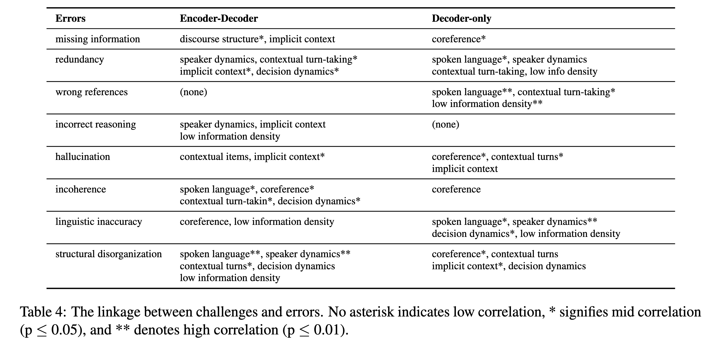
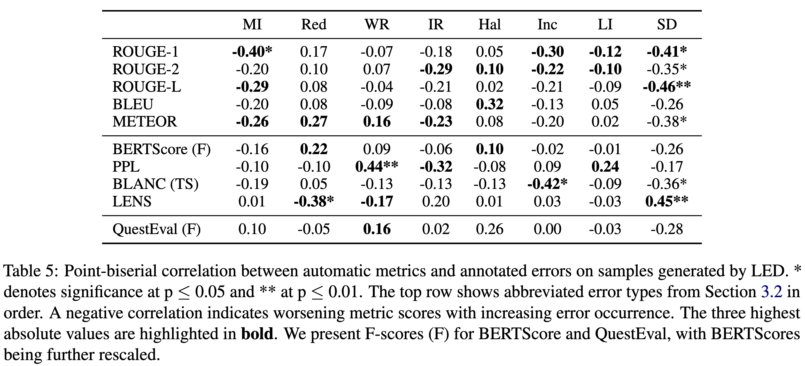
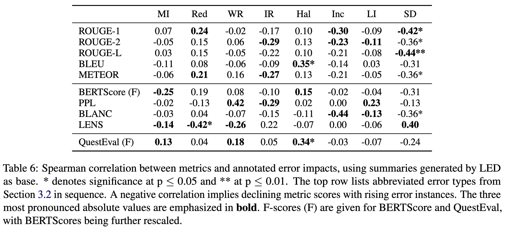

# What’s under the hood: Investigating Automatic Metrics on Meeting Summarization

This software project accompanies the research paper, [What’s under the Hood: Investigating Automatic Metrics on Meeting Summarization](https://aclanthology.org/2024.findings-emnlp.393/). **This paper has been accepted by EMNLP 2024 Findings.**


## Content of the work
We let annotators assess summaries generated with LED, DialogLED, Pegasus-X, GPT-3.5, and Zephyr-7B-α on a set of error types and challenges we derive from a literature review of works on meeting summarization since 2019.
We evaluate the generated summaries using different common automatic metrics, i.e., count-baseD (ROUGE, BLEU, METEOR), model-based (BERTScore, Perplexity, BLANC, LENS), and QA-based (QuestEval) and correlate the metrics' scores with the human assessment to analyze what these metrics represent in their scores and where limitations remain.

## Results
**Link between challenges and errors**
<p align="center">

</p>

> We observe an architecture-related pattern in handling challenges and resulting errors, indicating that employing LLMs for meeting summarization requires an updated focus on weaknesses and new mitigation techniques. 

**Metric-Error-Correlation**
<p align="center">

</p>

> No single metric effectively captures all types of errors, as most show only weak to moderate correlations. Combining metrics such as ROUGE, BLANC, and LENS can provide a more comprehensive assessment, but requires further validation and careful weighting of scores.

> Automatic metrics can mask errors by showing near-zero or positive correlations with them, failing to sufficiently penalize certain mistakes, and, in some cases, even reinforcing errors due to limitations in their design and focus.

**Metric-Impact-Correlation**
<p align="center">

</p>

> Metric scores generally show negligible to weak correlations with error severity, indicating their limited ability to discern the impact of errors in meeting summarization, with some metrics like BLEU and QuestEval even displaying positive correlations with hallucination errors, highlighting their vulnerability to such issues.

## Run the project
**Notice**
- The project was created using Python 3.9, torch 1.13., transformers 4.8. on Windows.
- We use OpenAI API to make requests to LLMs for GPT-3.5.

### Step 1: Dataset generation
For encoder-decoder models from Huggingface (LED, DialogLED, Pegasus-X), we base our generation pipeline on the example from [here]().
The models were trained on the QMSum training set.
Example command for LED:

```bash
python -m pipeline.py `
    --model_name_or_path "MingZhong/DialogLED-base-16384" `
    --do_train `
    --train_file "<location of QMSum>" `
    --do_eval `
    --validation_file "<location of QMSum>" `
    --do_predict `
    --test_file "<location of QMSum>" `
    --output_dir "<output_dir>" `
    --overwrite_output_dir `
    --per_device_train_batch_size 1 `
    --per_device_eval_batch_size 1 `
    --predict_with_generate `
    --save_steps 2000 `
    --eval_steps 5000 `
    --evaluation_strategy steps `
    --logging_steps 250 `
    --save_total_limit 2 `
    --fp16 `
    --fp16_full_eval `
    --max_source_length 16384 `
    --max_target_length 1024 `
    --gradient_accumulation_steps 8 `
    --gradient_checkpointing `
    --optim "adafactor" `
    --tester "ami"
    --proxy "_"

```

### Step 2: Evaluation
The scripts used to evaluate the automatic summaries are stated in metrics/scripts.
The individual scripts may have conflicting dependencies.

## Citation

```
@inproceedings{kirstein-etal-2024-whats,
    title = "What{'}s under the hood: Investigating Automatic Metrics on Meeting Summarization",
    author = "Kirstein, Frederic  and
      Wahle, Jan Philip  and
      Ruas, Terry  and
      Gipp, Bela",
    editor = "Al-Onaizan, Yaser  and
      Bansal, Mohit  and
      Chen, Yun-Nung",
    booktitle = "Findings of the Association for Computational Linguistics: EMNLP 2024",
    month = nov,
    year = "2024",
    address = "Miami, Florida, USA",
    publisher = "Association for Computational Linguistics",
    url = "https://aclanthology.org/2024.findings-emnlp.393",
    pages = "6709--6723",
    abstract = "Meeting summarization has become a critical task considering the increase in online interactions. Despite new techniques being proposed regularly, the evaluation of meeting summarization techniques relies on metrics not tailored to capture meeting-specific errors, leading to ineffective assessment. This paper explores what established automatic metrics capture and the errors they mask by correlating metric scores with human evaluations across a comprehensive error taxonomy. We start by reviewing the literature on English meeting summarization to identify key challenges, such as speaker dynamics and contextual turn-taking, and error types, including missing information and linguistic inaccuracy, concepts previously loosely defined in the field. We then examine the relationship between these challenges and errors using human annotated transcripts and summaries from encoder-decoder-based and autoregressive Transformer models on the QMSum dataset. Experiments reveal that different model architectures respond variably to the challenges, resulting in distinct links between challenges and errors. Current established metrics struggle to capture the observable errors, showing weak to moderate correlations, with a third of the correlations indicating error masking. Only a subset of metrics accurately reacts to specific errors, while most correlations show either unresponsiveness or failure to reflect the error{'}s impact on summary quality.",
}
```
